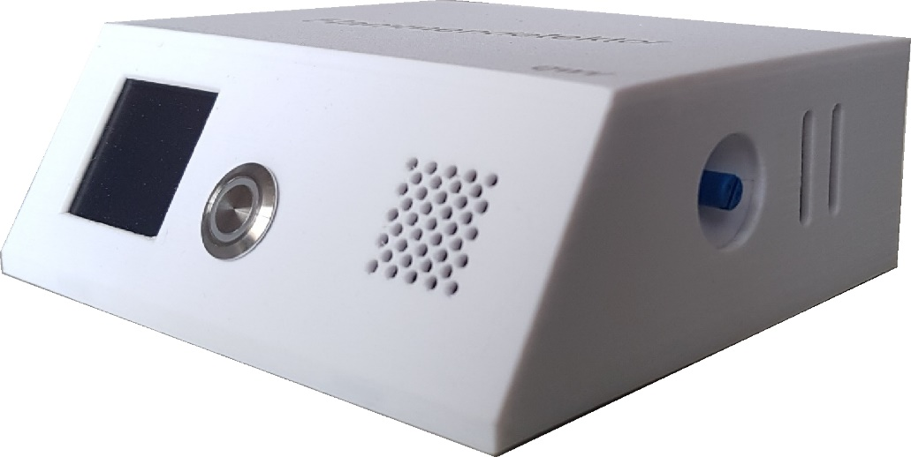
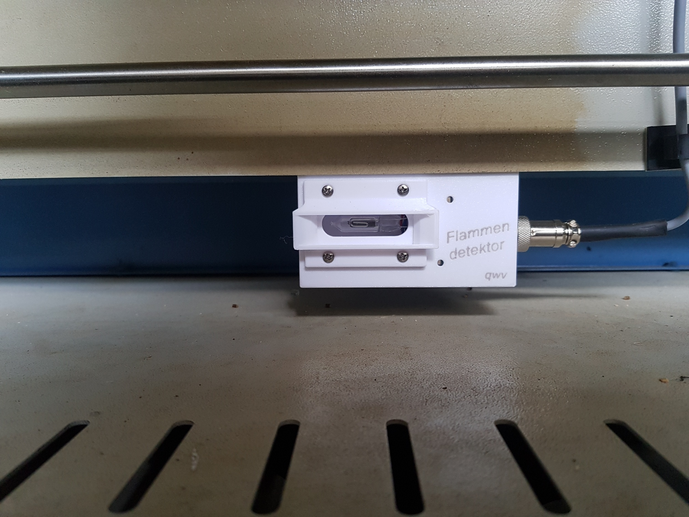

# Flammendetektor der QWV

(ein Feuer-Alarm-System für den Lasercutter basierend auf einem UV-Sensor)

## Warum?

Beim Gravieren oder Schneiden mit dem Laserstrahl entstehen immer wieder Flammen, die – wenn sie nicht sofort gelöscht werden – Schaden am Laserkopf oder sogar einen Brand verursachen können. 

Wann entstehen Flammen:

- kleinere Flammen am Laserpunkt und leichter Geruch können manchmal auftreten. 
- wenn die Druckluft bei der Linse am Laserkopf nicht eingeschaltet ist.
- wenn bei leicht entzündlichen Materialien eine zu hohe Leistung oder eine zu langsame Schnittgeschwindigkeit gewählt wird, oder sich starke Kunststoffablagerungen von früheren Arbeiten auf dem Gittertisch oder den dünnen Tragstäben aufgebaut haben.

Wie lösche ich Flammen:

- Zum Pausieren «▶ ∥» drücken 
- Wenn nötig Abdeckung öffnen und Flamme ausblasen 
- Sicherstellen, dass die Absaugung angeschaltet ist und das Manometer für die Druckluft bei der Linse ca. 3 bar anzeigt. 

(Bei manchem Material lässt es sich nicht vermeiden und dann ist es auch nicht weiter schlimm, wenn nur kleine Flammen entstehen). 

## Im Ernstfall

Bei größeren Flammen oder starker Rauchentwicklung muss das Lasern sofort unterbrochen werden, da sonst die Linse beschädigt wird:

- Deckel leicht öffnen (Laser wird ausgeschaltet, der Antrieb fährt jedoch weiter). 
- Laserprozess stoppen und den Laserkopf mit den Pfeil-Tasten am Bedienpult in eine von den Flammen entfernte Position fahren. 
- Deckel öffnen und versuchen die Flammen mit pusten oder abdecken zu löschen.
- Letzter Ausweg ist das Löschen mit dem CO2 -Löscher in kurzen Sprüh-stössen. Der passende Feuerlöscher befindet sich links beim Durchgang zum Metall-Raum an der Wand.
- **Bei weiterer Eskalation die Feuerwehr rufen**, anwesende Personen warnen und mit allen den Raum verlassen — Erstickungsgefahr durch CO2 und durch Rauch!

Bei einer permanenten Überwachung des Laservorgangs, kann der User sofort eingreifen. Dies genügt in der Regel, um Schaden zu vermeiden. 

Ruht aber der Blick nicht immer auf dem Laserprozess, dauert es oft zu lange, bis die Flammenbildung erkannt wird und es kommt zum Ernstfall.

> Der installierte Feuerdetektor kann den User nicht von der Überwachungspflicht befreien, ihm aber helfen rechtzeitig zu reagieren und grösseren Schaden zu vermeiden.

## **Funktion**

### Der **UV-Flammensensor**

überwacht den ganzen Arbeitsbereich auf vorhandene Flammen. Bei jeder erkannten Flamme, sendet der Sensor – gleichzeitig mit dem Blinken der gelben LED - Impulse an die Steuerung (je grösser die Flamme, umso höher ist die Puls-Frequenz).

### Steuerung

Bei jedem Impuls des Sensors erfolgt ein optisches (rote LED) und akustisches Signal am Bedienpult. Die Steuerung misst die Zeitspanne zwischen den letzten Impulsen (Frequenz) und bewertet so die Gefahrenstufe.
 Handelt es sich nur um ein kurzes oder kleines Aufflammen, so wird dies vorerst toleriert und keine Aktion ausgelöst. 

Sobald aber dauernd grössere Flammen erfasst werden, erscheint auf dem Display eine Gefahrenwarnung, begleitet von einem optischen (rote LED) und akustischen Alarm. 

Unternimmt der User nach drei Gefahrenmeldungen keine Massnahmen zur Verhinderung der Flammenbildung, so wird der Laservorgang unterbrochen. 
 Dies, mit der gleichen Wirkung, wie wenn die Pausen-Taste «▶ ∥» am Laser-Panel gedrückt worden wäre. 

➔ Der Laserkopf bleibt in seiner Position stehen und kann, nach dem Löschen der Flammen, den Laser-Auftrag weiterführen.

Dazu ist am Display die Reset-Taste und am Lasercutter-Panel die «ENTER»-Taste zu drücken.
